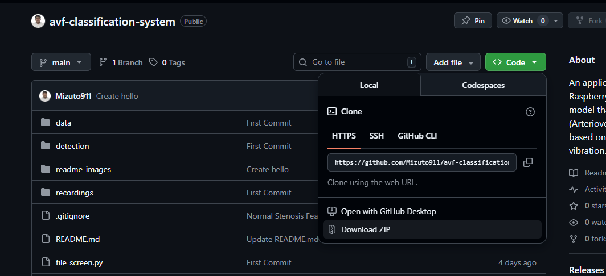
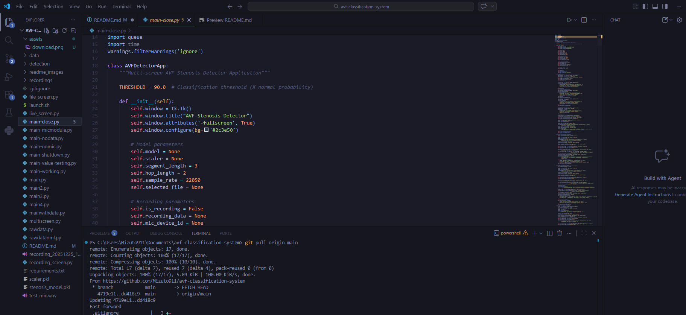
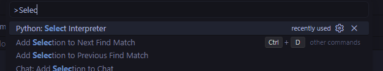
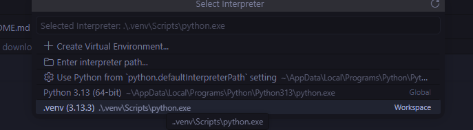

# AVF Classification System

Hi guys! Ito ang ating system. For now ilalagay ko muna dito kung paano sya gamitin with your VS Code and kung paano irun ang code. If may gusto kayong baguhin, gumawa kayo ng sarili nyong branch tapos saka nyo ipush.

## How to download the code.

1. Punta kayo sa **Code<>** section tapos just press download.

   

2. Extract and open the folder in your code editor, in my case ay VS Code.

   

3. To create your own virtual environment for python, run the following code. (Make sure muna na you have python installed sa system mo.)

   ```
   py -3 -m venv .venv
   ```

   Then activate your virtual environment with the following code.

   ```
   .venv/Scripts/activate
   ```

   Then install all the required libraries with the following code.

   ```
   pip install -r requirements.txt
   ```

4. You need to select the proper python interpreter para dito sa project. To do that:

   Open command pallete _(ctrl+shift+p)_ and search for **Python: Select Interpreter**

   

   Once clicked, hanapin nyo yung virtual environment mo, click it.

   

5. Once finished, to run yung code you simply need to run this code sa terminal.

   ```
   py your_file_name.py
   ```

   There are two codes to take into account, ito yung pinachecheck ko din sa inyo.
   - main-value-testing.py
   - main-range-finder.py

   So you can run each code with the following:

   ```
   py main-calue-testing.py
   ```

   or

   ```
   py main-range-finder.py
   ```

### That's all, you are free to explore the rest. <3
